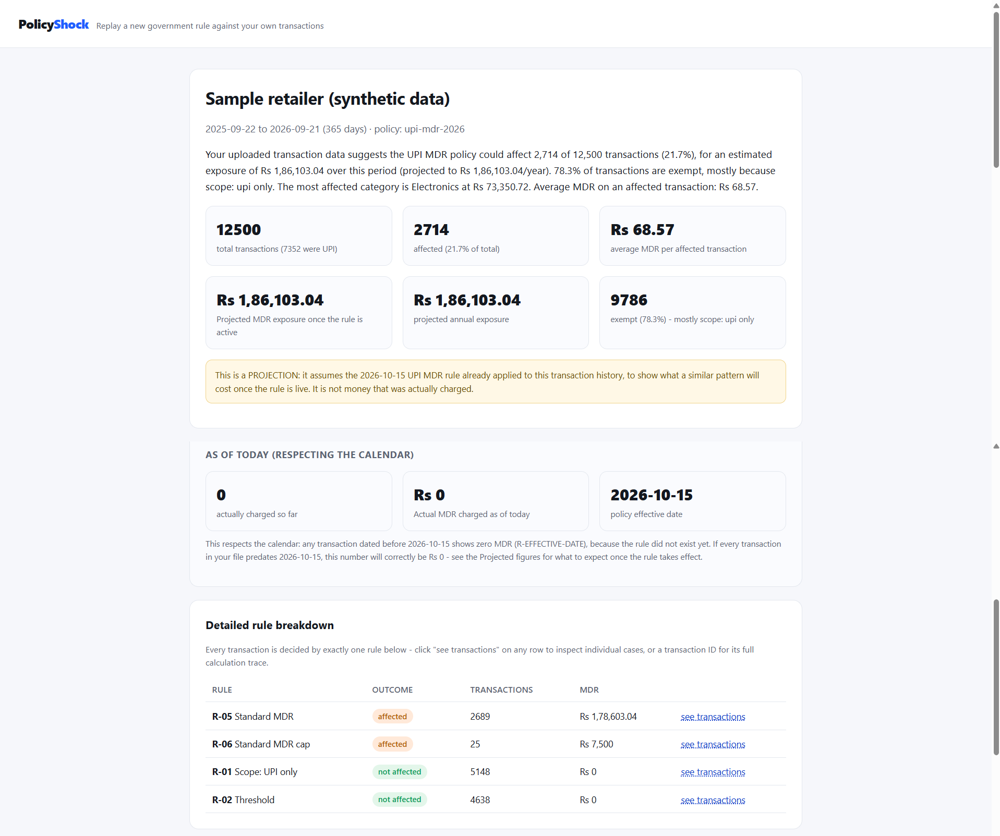
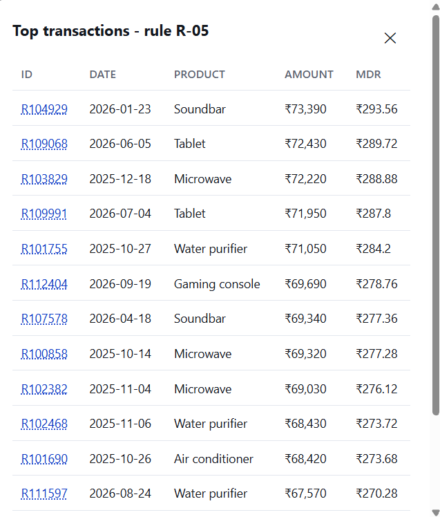
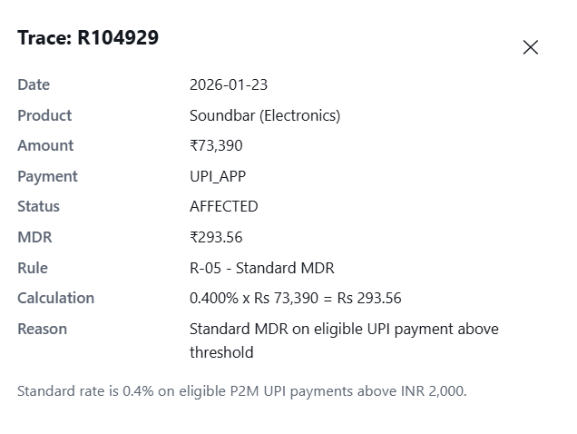
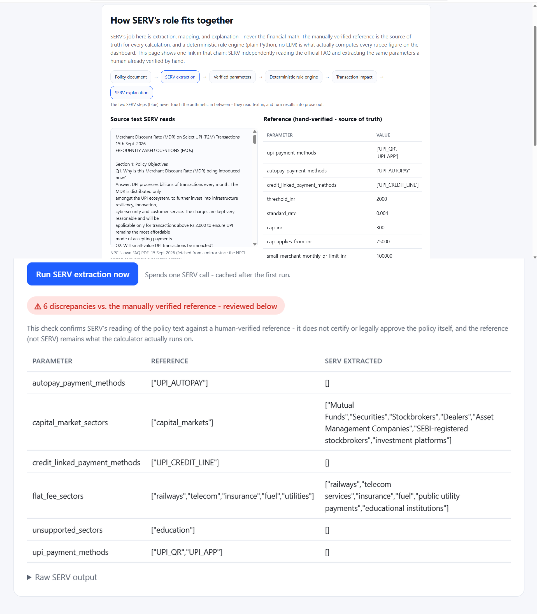
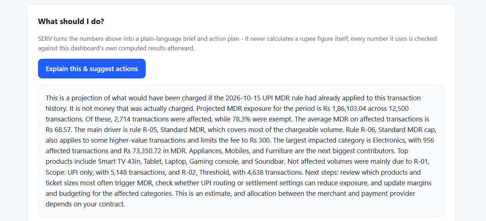

# PolicyShock

Replay a new government policy against a merchant's own transactions and show exactly what it
will cost, transaction by transaction, with a full audit trail back to the policy's own text.

First policy pack: India's UPI Merchant Discount Rate (MDR) framework, effective 15 October
2026, verified directly against the full text of NPCI's own FAQ document.

Built for the OpenServ SERV Hackathon, Edition 01.

## The problem

A business can read a new regulation at a headline level ("0.4% MDR on UPI payments above
Rs 2,000") but cannot easily tell how that rule affects its own transactions, margins, and
operations. Existing tools either summarize the policy in prose or offer a generic calculator
that ignores exemptions, sector-specific rates, and edge cases the business actually has.

PolicyShock replays the policy against the business's own transaction history instead of just
summarizing it: upload a CSV, get a transaction-by-transaction breakdown of what is affected,
what is exempt and why, and a plain-language explanation and action plan.

## Screenshots

**Business-first dashboard** — plain-English summary up top, projected vs. actually-charged
figures kept separate, full rule-by-rule breakdown below.


**Transaction drilldown** — click any rule to see every transaction it fired on.


**Full calculation trace** — click any transaction ID for the exact rule, formula, and reason.


**SERV rule verification** — SERV's live extraction from the official FAQ text, diffed against
the hand-verified reference.


**Plain-language explanation** — SERV's brief and action plan, numbers checked against the
engine's own output before display.


## Architecture overview

The system is split so that SERV (via `policyshock/serv_client.py` and `policyshock/pipeline.py`)
never performs financial arithmetic. All money math lives in `policyshock/engine.py`, a plain
deterministic Python module with no LLM involved. SERV's role is extraction, mapping, and
explanation, each independently verifiable against a human-checked reference:

| Module | Role |
|---|---|
| `policyshock/serv_client.py` | Thin, cached wrapper around the SERV Reasoning API (OpenAI-compatible Chat Completions). Every response is cached on disk in `.serv_cache/`, so re-running a demo spends no additional credits. |
| `policyshock/engine.py` | Deterministic rule engine. Every transaction is evaluated against `rules/upi_mdr_2026.json` and returns a status, an MDR figure, the exact rule ID that fired, a human-readable reason, and the calculation. Runs in two modes: `actual` (respects the policy's effective date; anything before it shows Rs 0) and `projected` (uses historical volume as a stand-in for cost once the policy is live). Also builds the deterministic, no-LLM impact summary shown at the top of the dashboard. |
| `policyshock/pipeline.py` | The three SERV-backed capabilities, each independently verifiable: (1) `extract_and_verify_rules` reads the official policy FAQ text and extracts structured parameters, diffed against the hand-verified reference in `rules/upi_mdr_2026.json`; (2) `map_csv_columns` maps a merchant's raw CSV headers (`Total_INR`, `tx_amount`, etc.) onto the required schema so a real payment-provider export works without manual renaming; (3) `explain_results` turns the engine's computed output into a plain-language business brief. |
| `policyshock/rulecheck.py` | The verification layer sitting between SERV and the user: `diff_rules` compares SERV's extracted parameters against the reference; `check_explanation_numbers` verifies every number in SERV's explanation against the engine's computed results plus known policy constants (rate, threshold, cap), catching invented or altered figures, including a wrong rate like "4%" that a naive number check would miss. |
| `webapp/app.py` | Flask application tying it together: CSV upload with SERV-assisted column auto-mapping, a business-first dashboard, a transaction-level trace view, and a rule-verification page showing SERV's extraction live against the reference. |

Data flow for a single analysis:

```
Policy FAQ text
      -> SERV extraction (pipeline.extract_and_verify_rules)
      -> diffed against hand-verified reference (rulecheck.diff_rules)
      -> deterministic rule engine runs on the REFERENCE, never SERV's raw output (engine.replay)
      -> transaction-level impact, aggregated (engine.summarize)
      -> SERV explanation (pipeline.explain_results)
      -> verified against computed numbers and policy constants (rulecheck.check_explanation_numbers)
```

## Features

- Deterministic UPI MDR calculation: standard 0.4% rate with a Rs 300 cap above Rs 75,000,
  Rs 5 flat-fee sectors (railways, telecom, insurance, fuel, utilities), a 3-consecutive-month
  small-merchant (P2PM) migration test, UPI Autopay/recurring-mandate exemption, a 0.02%
  capital-markets rate with its own cap, and credit-linked UPI correctly excluded as out of scope.
  Every rule cites the exact FAQ question it comes from.
- Effective-date awareness: a transaction dated before 15 October 2026 is never shown as actually
  charged. A separate "projected" figure uses historical volume to estimate exposure once the
  rule is live, shown alongside the real (calendar-respecting) number.
- SERV-assisted CSV column auto-mapping for real-world exports with non-matching headers.
- A rule-verification page where SERV independently re-extracts the policy's parameters from the
  official FAQ text and is diffed live against the hand-verified reference.
- A transaction-level trace view: click any rule, then any transaction, to see the exact
  calculation and the rule text that produced it.
- 34 automated tests covering the rule engine, the effective-date gate, the SERV-response
  verification logic (using mocked responses, no API key required to run them), and known
  edge cases such as the capital-markets cap and the P2PM migration streak.

## Setup

1. Clone the repository and install dependencies:
   ```
   pip install -r requirements.txt
   ```
2. Copy the environment template and add your SERV credentials:
   ```
   cp .env.example .env
   ```
   Edit `.env` and set `SERV_API_KEY` to your own key. `SERV_BASE_URL` and `SERV_MODEL` are
   already filled in with working defaults. `.env` is listed in `.gitignore` and is never
   committed.
3. Confirm the credentials work:
   ```
   python scripts/smoke_test.py
   ```
   This makes one small SERV call and prints the reply plus token usage.

## Running the demo

Command-line, no web server:
```
python scripts/run_demo.py retailer
python scripts/run_demo.py small_shop
python scripts/run_demo.py investment_platform
```
Each prints headline numbers, a rule-by-rule breakdown, and a trace of the largest affected
transaction for one of the three synthetic sample merchants.

Full web application:
```
python -m webapp.app
```
Open `http://127.0.0.1:5000`. From the landing page, pick a sample merchant or upload a CSV
(required columns: `transaction_id`, `date`, `product`, `category`, `amount`, `payment_method`;
mismatched headers are auto-mapped by SERV). The dashboard leads with a plain-English business
summary before any technical detail. Click "See how SERV's role fits together" to run the live
rule-extraction verification.

Running the test suite:
```
python -m unittest discover -s tests
```

## Deployment

The app is ready for any free-tier platform that runs a standard Python web service
(Render, Railway, Fly.io).

- `Procfile` defines the start command: `gunicorn --chdir . webapp.app:app --bind 0.0.0.0:$PORT`
- `render.yaml` is a one-click Render Blueprint. Set `SERV_API_KEY`, `SERV_BASE_URL`, and
  `SERV_MODEL` as environment variables in the platform's dashboard after deploying; do not
  commit them.
- `.python-version` pins the Python version used during development and testing (3.12).

To deploy on Render: push this repository to GitHub, create a new Blueprint on Render pointing
at the repo, and set the three SERV environment variables when prompted.

## Project structure

```
rules/upi_mdr_2026.json       Hand-verified rule spec, cited to exact FAQ question numbers
rules/upi_mdr_faq_text.txt    Full official FAQ text used for the SERV extraction demo
policyshock/engine.py         Deterministic rule engine (all arithmetic)
policyshock/pipeline.py       SERV-backed extraction, CSV mapping, and explanation
policyshock/rulecheck.py      Verification layer between SERV and the user
policyshock/serv_client.py    Cached SERV API wrapper
scripts/generate_sample.py    Synthetic sample data generator
scripts/run_demo.py           Command-line demo
scripts/smoke_test.py         One-call SERV connectivity check
webapp/                       Flask application
tests/                        34 automated tests
```

## Known limitations

- Education-sector MDR is intentionally left unmodeled (`unsupported`, not guessed), because
  NPCI's own FAQ states a flat-fee structure applies without giving an exact figure.
- The rule spec's Autopay-exemption and capital-markets figures are corroborated by multiple
  press sources citing the same NPCI FAQ but have not been individually re-checked against the
  PDF's own question numbers.
- Session storage is a local JSON file per analysis; this is adequate for a demo but not for
  concurrent production use.

## License

MIT. See `LICENSE`.
